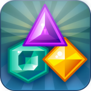

***

# Jewels

# By:

### Top

# `README.md`

***

# Index

[00.0 - Top](#Top)

[01.0 - Index](#Index)

[02.0 - Description](#SeansLifeArchive_Images_Jewels_-Android_Game-)

[03.0 - About](#About)

[04.0 - Wiki](#Wiki)

[05.0 - Version history](#Version-history)

[06.0 - Contributers](#Contributers)

[07.0 - Issues](#Issues)

> [07.1 - Current issues](#Current-issues)

> [07.2 - Past issues](#Past-issues)

> [07.3 - Past pull requests](#Past-pull-requests)

> [07.4 - Active pull requests](#Active-pull-requests)

[08.0 - Resources](#Resources)

[09.0 - Contributing](#Contributing)

[10.0 - About README](#About-README)

[11.0 - README Version history](#README-version-history)

[12.0 - Footer](#You-have-reached-the-end-of-the-README-file)

***

# SeansLifeArchive_Images_Jewels_-Android_Game-
The module for my life story project that contains my Jewels gameplay images.

***

## About

See above. This repository hosts all my daily Jewels session pictures. I currently play the [Android version](https://play.google.com/store/apps/details?id=org.mhgames.jewels&hl=en_US&gl=US) there is a version available for iOS called iJewels. As of November 8th 2020, it no longer exists.

These daily pictures are to be used for progress monitoring, but can also be used as stock images.

I started playing Jewels all the way back in the fall of 2009. It was my first Android game. I remember playing it during my vacation in Alaska.

I started playing the game again in September 2020 during my 2020 Cannon Beach Vacation. My current goal is to max out the score in zen mode. As of November 7th 2020, I am 45.22% to the goal, with a score of 4522420. I am hoping an extra digit doesn't get added once I reach a score of 9999990.

***

## Wiki

[Click/tap here to view this projects Wiki](https://github.com/seanpm2001/SeansLifeArchive_Images_Jewels_-Android_Game-/wiki)

***

## Version history

Unavailable

[More versions coming soon](https://www.example.com)

***

## Contributers

Currently, I am the only contributer. Contributing is not allowed, as this is a personal project.

> * 1. [seanpm2001](https://github.com/seanpm2001/) - 212 commits (As of Sunday, November 8th 2020 at 3:43 pm)

> * 2. No other contributers.

***

## Issues

### Current issues

None at the moment

### Past issues

None at the moment

### Past pull requests

None at the moment

### Active pull requests

None at the moment

***

## Resources

Here are some other resources for this project:

[Project language file](LANG.rb)

[iJewels, the Apple version of Jewels (no longer exists)](https://apps.apple.com)

[Download an APK of Jewels using APKPure](https://apkpure.com/jewels/org.mhgames.jewels)

[Download the APK of Jewels through my APK collection repository](https://github.com/seanpm2001/SeansLifeArchive_Extras_APK-Archive/tree/main/APK_Collection/Jewels)

No other resources at the moment.

***

## Contributing

Contributing is not allowed for this project, as it is a personal project.

[Click/tap here to view the contributing rules for this project](https://github.com/seanpm2001/SeansLifeArchive_Images_Jewels_-Android_Game-/blob/master/CONTRIBUTING.md)

***

## About README

File type: `Markdown (*.md)`

File version: `2 (Sunday, November 8th 2020 at 3:43 pm)`

Line count: `0,230`

***

## README version history

Version 1 (Sunday, November 8th 2020 at 3:30 pm)

> Changes:

> * Started the file

> * Added the title section

> * Added the index

> * Added the about section

> * Added the Wiki section

> * Added the version history section

> * Added the issues section.

> * Added the past issues section

> * Added the past pull requests section

> * Added the active pull requests section

> * Added the contributors section

> * Added the contributing section

> * Added the about README section

> * Added the README version history section

> * No other changes in version 1

Version 2 (Sunday, November 8th 2020 at 3:43 pm)

> Changes:

> * Updated the about section

> * Added the resources section

> * Added release notes for v2

> * Added template entries for v3 and v4

> * Updated the file info section

> * Updated the index

> * Updated the contributers section

> * No other changes in version 2

Version 3 (coming soon)

> Changes:

> * Coming soon

> * No other changes in version 3

Version 4 (coming soon)

> Changes:

> * Coming soon

> * No other changes in version 4

***

### You have reached the end of the README file

[Back to top](#Top) [Exit](https://github.com)

***
